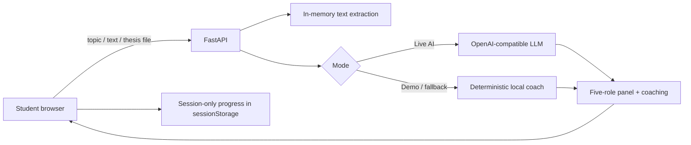

# Final Defence Coach

A lightweight bilingual **AI thesis-defence simulator** built for the **TNGIMPACT AI Challenge 2026**.

> Turn a thesis into a five-examiner mock panel, practise answers by voice or text, and get structured coaching before the real defence.

## The problem

Students can understand their research and still struggle to defend it under questioning. Realistic mock panels require supervisor time, multiple reviewers, and repeated practice that may not always be available.

Final Defence Coach gives a student a repeatable practice loop in a browser: bring research context, face different examiner roles, answer naturally, see the weak area, then practise the next question.

## What makes this more than a generic chatbot

- **Five-role virtual panel** instead of one generic assistant:
  - Research supervisor — problem and impact
  - Methodology examiner — methods and alternatives
  - Evidence reviewer — results and evidence
  - External examiner — limitations
  - Impact reviewer — practical application
- **Research-aware input:** topic only, pasted context, or a PDF/TXT/Markdown thesis file.
- **Bilingual experience:** English and Hausa across the UI, questions, and coaching.
- **Defence-style practice:** hear a question aloud and, in supported browsers, dictate an answer.
- **Session learning:** practise all five questions, track average readiness, and see the weakest coaching dimension.
- **Structured feedback:** clarity, relevance, evidence, and structure — plus strengths, improvements, a safer answer framework, and one next-step tip.

## AI integration

### Live AI mode

With an OpenAI-compatible provider configured, the model is used for two meaningful tasks:

1. **Panel generation** — transform the student's topic/context into five distinct examiner questions.
2. **Answer coaching** — evaluate the response across four dimensions and return specific improvement guidance.

The prompt explicitly tells the model **not to invent research findings, numbers, citations, or facts**. When evidence is missing, the improved answer uses placeholders rather than fabricated content.

### Demo / resilience mode

`DEMO_MODE=true` provides a deterministic local simulation so judges can test the entire product without an API key or paid request. This mode is intentionally labelled as a demo simulation in the UI; it is not presented as a live model call.

If live AI is enabled but the provider rejects JSON mode, the backend automatically retries using a more broadly compatible request format. If the provider is still unavailable and `AI_FALLBACK_TO_DEMO=true`, the session continues with local coaching and the UI displays a fallback notice instead of crashing.

## 30-second judge flow

1. Open the app.
2. Click **Try the 30-second demo**.
3. The example research is loaded and a five-examiner panel appears.
4. Choose a panel question or keep the first one.
5. Click **Use sample answer** if needed.
6. Click **Evaluate this answer**.
7. Show the score breakdown, strengths, improvement area, and session progress.
8. Click **Practise another question** to demonstrate the repeated-learning loop.

## Thesis upload

The app accepts:

- PDF
- TXT
- Markdown (`.md`)

Files are read in memory, text is extracted, and at most the first 12,000 characters are used as research context. The uploaded file is **not written to disk or stored in a database**. Scanned PDFs without an embedded text layer are not OCR'd in this hackathon version.

## Languages

- English (`en`)
- Hausa (`ha`)

The selected language controls the interface and the requested output language for live AI panel questions and coaching.

## Architecture



There is no account system and no database. This keeps the prototype easy to deploy, easy to inspect, and suitable for a short hackathon demo.

## Stack

- Python 3.12+
- FastAPI
- HTML / CSS / vanilla JavaScript
- httpx
- pypdf
- pytest
- GitHub Actions
- Docker

## Quick start

```bash
python -m venv venv
source venv/Scripts/activate   # Git Bash on Windows
pip install -r requirements.txt
cp .env.example .env
python -m uvicorn main:app --reload
```

Open `http://127.0.0.1:8000`.

## Configuration

Safe default:

```env
DEMO_MODE=true
AI_FALLBACK_TO_DEMO=true
```

Optional live AI:

```env
DEMO_MODE=false
AI_FALLBACK_TO_DEMO=true
LLM_API_KEY=your_key_here
LLM_BASE_URL=https://api.example.com/v1
LLM_MODEL=your-model-id
```

Never commit `.env` or API keys.

## API

- `GET /` — web application
- `GET /health` — version, mode, language and upload capabilities
- `POST /api/extract` — extract research context from PDF/TXT/MD in memory
- `POST /api/questions` — create the five-role defence panel
- `POST /api/evaluate` — return structured coaching for one answer

Example panel request:

```json
{
  "topic": "AI-assisted crop disease detection for smallholder farmers",
  "abstract": "",
  "language": "en"
}
```

## Quality and reliability

The GitHub Actions pipeline performs:

1. dependency installation;
2. Python compilation check;
3. automated API/product-flow tests;
4. Docker image build.

Run locally with:

```bash
pytest -q
```

Tests cover English and Hausa, topic-only use, five distinct panel roles, coaching dimensions, safer answer frameworks, plain-text thesis extraction, validation, security headers, and the main demo UI entry points.

## Privacy and safety decisions

- No accounts or database.
- `.env` is ignored and secrets are never required for demo mode.
- Thesis uploads are not persisted by the backend.
- Draft topic/context uses `sessionStorage`, so it is scoped to the current browser tab rather than permanent local storage.
- API responses use `Cache-Control: no-store`.
- Coaching does not claim to verify the scientific truth of the thesis.
- Live AI prompts explicitly prohibit invented evidence.

## TNGIMPACT judging fit

| Criterion | Product decision |
| --- | --- |
| Real-world Impact | Repeated thesis-defence practice for students with limited access to mock panels |
| Technical Execution | FastAPI, file extraction, robust LLM compatibility/fallback, tests, CI, Docker, security headers |
| Innovation & Originality | Five-role bilingual virtual panel + session coaching rather than a one-shot chatbot |
| UX & Design | One-click demo, mobile layout, voice features, file upload, clear progress and actionable feedback |
| Presentation | Full core story can be demonstrated without setup or a paid API |

## Known limitations

This remains a focused hackathon prototype:

- Browser speech recognition support varies by browser and operating system.
- Hausa speech recognition/voice quality depends on the browser's available language services.
- Demo mode uses deterministic local heuristics; live AI mode is required for model-generated research-specific reasoning.
- PDF extraction works for PDFs with selectable text; scanned image-only PDFs need OCR, which is intentionally outside this MVP.
- The app does not replace an academic supervisor or validate whether research findings are correct.

## License

MIT
