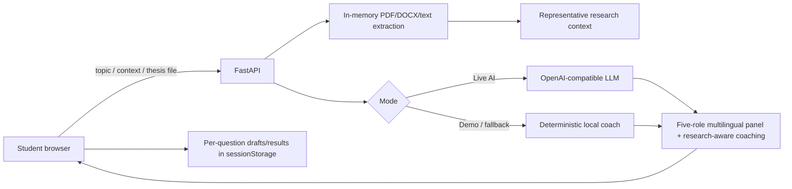

# Final Defence Coach

A multilingual **AI thesis-defence simulator** built for the **TNGIMPACT AI Challenge 2026**.

> Turn a thesis into a five-examiner mock panel, keep your practice answers across the session, and get research-aware coaching before the real defence.

## The problem

Students can understand their research and still struggle to defend it under questioning. Realistic mock panels require supervisor time, multiple reviewers, and repeated practice that may not always be available.

Final Defence Coach gives a student a repeatable browser-based practice loop: bring research context, face different examiner roles, answer naturally, review a weak area, retry it, and see whether the answer improves.

## Product flow

1. Enter only a thesis topic, paste research context, or upload a thesis file.
2. Build a five-examiner virtual panel.
3. Practise any question by text or, where supported, voice.
4. Receive structured coaching across clarity, relevance, evidence, and structure.
5. Switch between questions without losing draft answers or previous feedback.
6. Complete all five examiner roles and retake the weakest question.
7. On a retake, compare the new practice score with the previous attempt.

## Languages

The product supports:

- English (`en`)
- Hausa (`ha`)
- Yorùbá (`yo`)
- Igbo (`ig`)
- Kiswahili (`sw`)
- isiZulu (`zu`)

The selected language controls the demo example, panel roles, questions, coaching output, browser speech language, interface copy, and the requested output language in live-AI mode.

The public-facing message is **Multilingual for Africa** rather than presenting the product as only “English + Hausa”.

## Visual identity

The interface uses a warm pan-African direction without relying on flags, maps, safari imagery, or caricatures:

- earth, terracotta, gold, deep green, cream and sand tones;
- a restrained geometric textile-inspired motif;
- editorial display typography with a simple system UI font;
- mobile-responsive layouts and accessible focus states.

The design does not claim that a single pattern or palette represents every African culture.

## What makes it more than a generic chatbot

- **Five-role virtual panel**: research supervisor, methodology examiner, evidence reviewer, external examiner, and impact reviewer.
- **Research-aware input and coaching**: the same thesis context used to create questions is also supplied when evaluating the student's answer.
- **Common thesis formats**: PDF, DOCX, TXT and Markdown.
- **Long-document sampling**: when a thesis exceeds the 12,000-character coaching context, the app samples representative sections from the beginning, middle and end instead of silently using only the first pages.
- **Session memory without an account**: each question keeps its own draft and previous feedback in `sessionStorage` for the current browser tab.
- **Retake loop**: the student can retry the weakest question and see the score change from the previous attempt.
- **Six-language practice loop**.
- **Voice support where the browser provides it**, with a text fallback when it does not.

## AI integration

### Live AI mode

With an OpenAI-compatible provider configured, the model is used for two meaningful tasks:

1. **Panel generation** — transform the student's topic and research context into five distinct examiner questions.
2. **Research-aware answer coaching** — compare the student's answer with the supplied thesis context and return actionable feedback.

Prompts explicitly prohibit invented research findings, numbers, citations, or facts. When evidence is missing, the model is instructed to say so or use placeholders.

### Demo / resilience mode

`DEMO_MODE=true` provides a deterministic local simulation so judges can test the full product without an API key or paid request.

The UI labels the result as a **practice score**, not an academic grade. It also explains that demo scoring is a local coaching estimate and does not verify scientific correctness.

If live AI is enabled but the provider rejects JSON mode, the backend retries with a more broadly compatible OpenAI-style request. If the provider remains unavailable and `AI_FALLBACK_TO_DEMO=true`, the session continues with local coaching rather than crashing.

## 30-second judge flow

1. Open the app and choose any supported language.
2. Click **Try the 30-second demo**.
3. A localized example and five-examiner panel appear.
4. Keep the sample answer or type your own.
5. Evaluate the answer and show the practice-score breakdown and coaching.
6. Move to another examiner and show that drafts/results are preserved.
7. Retake a completed question to demonstrate score improvement tracking.

## Thesis upload

Accepted formats:

- PDF
- DOCX
- TXT
- Markdown (`.md`)

Maximum file size is **12 MB**. Files are read in memory and are not written to disk or stored in a database.

For long documents, the backend keeps a maximum 12,000-character research context using representative slices from the **beginning, middle, and end**. This is intended to cover more of the research story than a simple “first 12,000 characters” truncation.

Scanned image-only PDFs without an embedded text layer are not OCR'd in this hackathon version.

## User-safety and trust decisions

Several product decisions deliberately reduce confusing or destructive behavior:

- Draft answers are preserved separately for each examiner question.
- Completed questions reopen with their previous feedback.
- Changing language, replacing research, using the demo/example, or starting over warns before clearing an active session.
- Editing the thesis context cannot silently leave old questions attached to new research.
- The score has a human-readable level such as **Developing** or **Strong**, plus an explanation of what the score means.
- Retakes show the score delta from the previous attempt.
- Unsupported voice input falls back to text rather than blocking the session.
- Offline/API failures surface a clear error instead of silently failing.

## Architecture



There is no account system and no database.

## Stack

- Python 3.12+
- FastAPI
- HTML / CSS / vanilla JavaScript
- httpx
- pypdf
- python-docx
- pytest
- GitHub Actions
- Docker

## Quick start

```bash
python -m venv venv
source venv/Scripts/activate   # Git Bash on Windows
pip install -r requirements.txt
cp .env.example .env
python -m uvicorn main:app --reload
```

Open `http://127.0.0.1:8000`.

## Configuration

Safe default:

```env
DEMO_MODE=true
AI_FALLBACK_TO_DEMO=true
```

Optional live AI:

```env
DEMO_MODE=false
AI_FALLBACK_TO_DEMO=true
LLM_API_KEY=your_key_here
LLM_BASE_URL=https://api.example.com/v1
LLM_MODEL=your-model-id
```

Never commit `.env` or API keys.

## API

- `GET /` — web application
- `GET /health` — runtime capabilities
- `POST /api/extract` — extract context from PDF/DOCX/TXT/MD in memory
- `POST /api/questions` — create the five-role defence panel
- `POST /api/evaluate` — return research-aware coaching for one answer

## Quality and reliability

GitHub Actions performs:

1. dependency installation;
2. Python compilation;
3. browser JavaScript syntax checks;
4. automated API/product-flow tests;
5. Docker image build.

Tests cover all six languages, research-aware scoring, DOCX/TXT extraction, long-thesis sampling, security headers, safer answer frameworks, validation, and the core demo flow.

## Privacy and security

- No account or database.
- `.env` is ignored and no secret is required in demo mode.
- Uploaded thesis files are not persisted by the backend.
- Drafts/results are scoped to the current browser tab through `sessionStorage`.
- API and health responses use `Cache-Control: no-store`.
- A restrictive Content Security Policy only permits same-origin scripts/styles/connections.
- Live-AI prompts explicitly prohibit fabricated research evidence.

## TNGIMPACT judging fit

| Criterion | Product decision |
| --- | --- |
| Real-world Impact | Repeatable defence practice for students with limited access to realistic mock panels |
| Technical Execution | FastAPI, PDF/DOCX extraction, research-aware evaluation, resilient LLM fallback, security headers, tests, CI, Docker |
| Innovation & Originality | Five-role multilingual panel with per-question learning and retakes rather than a one-shot chatbot |
| UX & Design | One-click demo, Africa-oriented visual identity, preserved drafts, mobile layout, voice fallback, file upload and clear progress |
| Presentation | The full product story can be demonstrated without setup or a paid API |

## Known limitations

- Demo mode remains heuristic; live AI is needed for genuinely semantic, research-specific reasoning.
- Browser speech recognition and speech synthesis quality varies by browser, OS and language.
- Scanned image-only PDFs require OCR, which is outside this focused hackathon build.
- Closing the browser tab intentionally clears the local practice session; there is no cloud history or account system.
- The app does not replace an academic supervisor or verify whether research findings are scientifically correct.
- Localized wording should receive native-speaker review before production deployment.

## License

MIT
