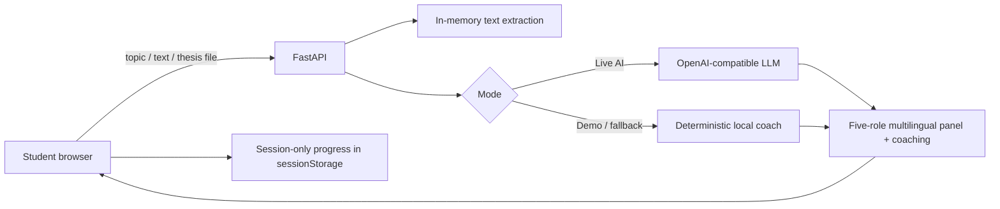

# Final Defence Coach

A multilingual **AI thesis-defence simulator** built for the **TNGIMPACT AI Challenge 2026**.

> Turn a thesis into a five-examiner mock panel, practise answers by voice or text, and get structured coaching before the real defence.

## The problem

Students can understand their research and still struggle to defend it under questioning. Realistic mock panels require supervisor time, multiple reviewers, and repeated practice that may not always be available.

Final Defence Coach gives a student a repeatable browser-based practice loop: bring research context, face different examiner roles, answer naturally, identify a weak area, then practise again.

## Languages

The full product flow now supports:

- English (`en`)
- Hausa (`ha`)
- Yorùbá (`yo`)
- Igbo (`ig`)
- Kiswahili (`sw`)
- isiZulu (`zu`)

The selected language controls the demo example, panel roles, questions, coaching output, browser speech language, UI labels, and the requested language in live-AI mode.

The interface intentionally avoids presenting the product as only “English + Hausa”. Its public-facing message is **Multilingual for Africa**.

## Visual identity

The interface uses an Africa-oriented visual system without relying on flags, maps, safari imagery, or caricatures:

- warm earth and terracotta tones;
- gold and deep green accents;
- cream/sand surfaces instead of generic SaaS blue-gray;
- a restrained geometric textile-inspired pattern in the hero;
- editorial serif display typography paired with a simple system UI font;
- language names shown in their native forms where appropriate.

The design is intentionally pan-African rather than claiming that one pattern or aesthetic represents every African culture.

## What makes this more than a generic chatbot

- **Five-role virtual panel**:
  - Research supervisor — problem and impact
  - Methodology examiner — methods and alternatives
  - Evidence reviewer — results and evidence
  - External examiner — limitations
  - Impact reviewer — practical application
- **Research-aware input:** topic only, pasted context, or a PDF/TXT/Markdown thesis file.
- **Multilingual practice:** six languages across the full practice loop.
- **Defence-style practice:** hear a question aloud and, where supported, dictate an answer.
- **Session learning:** practise all five questions, track average readiness, and see the weakest coaching dimension.
- **Structured feedback:** clarity, relevance, evidence, and structure, plus strengths, improvements, a safer answer framework, and one next-step tip.

## AI integration

### Live AI mode

With an OpenAI-compatible provider configured, the model is used for two meaningful tasks:

1. **Panel generation** — transform the student's topic/context into five distinct examiner questions.
2. **Answer coaching** — evaluate the response across four dimensions and return specific improvement guidance.

The prompt explicitly tells the model not to invent research findings, numbers, citations, or facts. When evidence is missing, the improved answer should use placeholders rather than fabricated content.

### Demo / resilience mode

`DEMO_MODE=true` provides a deterministic local simulation so judges can test the entire product without an API key or paid request.

If live AI is enabled but the provider rejects JSON mode, the backend retries with a more broadly compatible OpenAI-style request. If the provider is still unavailable and `AI_FALLBACK_TO_DEMO=true`, the session continues with local coaching instead of crashing.

## 30-second judge flow

1. Open the app.
2. Choose any supported language.
3. Click **Try the 30-second demo**.
4. A localized example research project and five-examiner panel appear.
5. Pick a question or keep the first one.
6. Use the sample answer or answer yourself.
7. Evaluate the response and show the score breakdown, strengths, improvement area, and session progress.
8. Practise another question to demonstrate the repeated-learning loop.

## Thesis upload

The app accepts:

- PDF
- TXT
- Markdown (`.md`)

Files are read in memory, text is extracted, and at most the first 12,000 characters are used as research context. The uploaded file is not written to disk or stored in a database. Scanned PDFs without an embedded text layer are not OCR'd in this hackathon version.

## Architecture



There is no account system and no database.

## Stack

- Python 3.12+
- FastAPI
- HTML / CSS / vanilla JavaScript
- httpx
- pypdf
- pytest
- GitHub Actions
- Docker

## Quick start

```bash
python -m venv venv
source venv/Scripts/activate   # Git Bash on Windows
pip install -r requirements.txt
cp .env.example .env
python -m uvicorn main:app --reload
```

Open `http://127.0.0.1:8000`.

## Configuration

Safe default:

```env
DEMO_MODE=true
AI_FALLBACK_TO_DEMO=true
```

Optional live AI:

```env
DEMO_MODE=false
AI_FALLBACK_TO_DEMO=true
LLM_API_KEY=your_key_here
LLM_BASE_URL=https://api.example.com/v1
LLM_MODEL=your-model-id
```

Never commit `.env` or API keys.

## API

- `GET /` — web application
- `GET /health` — version, mode, language and upload capabilities
- `POST /api/extract` — extract research context from PDF/TXT/MD in memory
- `POST /api/questions` — create the five-role defence panel
- `POST /api/evaluate` — return structured coaching for one answer

## Quality and reliability

The GitHub Actions pipeline performs dependency installation, Python compilation, browser JavaScript syntax validation, automated API/product-flow tests, and a Docker image build.

Tests cover all six supported languages, topic-only use, five distinct panel roles, coaching dimensions, safer answer frameworks, plain-text thesis extraction, validation, security headers, and the main demo UI entry points.

## Privacy and safety decisions

- No accounts or database.
- `.env` is ignored and secrets are never required for demo mode.
- Thesis uploads are not persisted by the backend.
- Draft topic/context uses `sessionStorage`, scoped to the current browser tab.
- API responses use `Cache-Control: no-store`.
- Coaching does not claim to verify the scientific truth of the thesis.
- Live-AI prompts explicitly prohibit invented evidence.

## TNGIMPACT judging fit

| Criterion | Product decision |
| --- | --- |
| Real-world Impact | Repeated thesis-defence practice for students with limited access to mock panels |
| Technical Execution | FastAPI, file extraction, robust LLM compatibility/fallback, six language paths, tests, CI, Docker |
| Innovation & Originality | Five-role multilingual virtual panel + session coaching rather than a one-shot chatbot |
| UX & Design | One-click demo, Africa-oriented visual identity, mobile layout, voice features, file upload, progress and actionable feedback |
| Presentation | Full core story can be demonstrated without setup or a paid API |

## Known limitations

- Browser speech recognition support varies by browser and operating system.
- Speech synthesis and recognition quality for individual African languages depends on the voices/services installed in the browser or OS.
- Demo mode uses deterministic local heuristics; live AI is required for model-generated research-specific reasoning.
- PDF extraction works for PDFs with selectable text; scanned image-only PDFs need OCR.
- The app does not replace an academic supervisor or validate whether research findings are correct.
- Localized wording is an initial hackathon localization and should receive native-speaker review before production deployment.

## License

MIT
